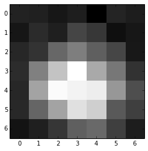

# shah-elife-2019
Code for "Nishal P. Shah, N. Brackbill, C. Rhoades, A. Tikidji-Hamburyan, G. Goetz, A. Litke, A. Sher, E. P. Simoncelli, E.J. Chichilnisky. Inference of Nonlinear Receptive Field Subunits with Spike-Triggered Clustering. ELife, 2019"

## Dependencies
The code requires Python 2, Tensorflow 1.x, and other standard libraries such as numpy, scipy and pickle.

## Prepare data
The data associated with the paper can be downloaded from "Shah, Nishal et al. (2020), Inference of nonlinear receptive field subunits with spike-triggered clustering, v4, Dryad, Dataset, https://doi.org/10.5061/dryad.dncjsxkvk"

The data for a given figure are loaded using pickle. 
```python
import pickle
data = pickle.load(open('Figure_2.pkl', 'rb'))
stim_use, resp_use, stim_dim1, stim_dim2 = (data['A']['stimulus'], data['A']['response'], 
                                            data['A']['stim_dim1'], data['A']['stim_dim2'])
```

Verify the loaded data. 
```python
sta = stim_use.T.dot(resp_use) / np.sum(resp_use)
plt.figure()
plt.imshow(np.reshape(sta[:, 0], [stim_dim1, stim_dim2]), 
         cmap='gray', interpolation='nearest')
```




## Fitting
Model paramerters are estimated using 
```python
op = su_model.spike_triggered_clustering(stim_use, resp_use, nsub,
                                         tms_train,
                                         tms_validate,
                                         steps_max=10000, eps=1e-9,
                                         projection_type=projection_type,
                                         neighbor_mat=neighbor_mat,
                                         lam_proj=lam_proj, eps_proj=0.01,
                                         save_filename_partial=save_filename_partial, 
                                         fitting_phases=[1, 2, 3])

k, b, nl_params, lam_log_train, lam_log_validation, fitting_phase, fit_params = op
```


Evaluate loss on test data:

```python
fitting_phase = 1
k, b, nl_params = fit_params[fitting_phase] 
lam_test = su_model.compute_fr_loss(k, b, stim_use[tms_test, :], resp_use[tms_test, :],
                                    nl_params=nl_params)
```

