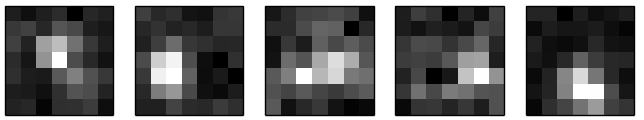
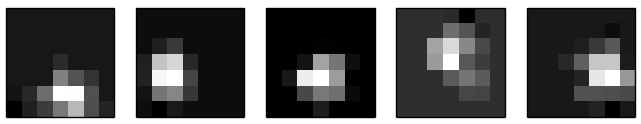

# shah-elife-2020
Code for "Nishal P. Shah, N. Brackbill, C. Rhoades, A. Tikidji-Hamburyan, G. Goetz, A. Litke, A. Sher, E. P. Simoncelli, E.J. Chichilnisky. Inference of Nonlinear Receptive Field Subunits with Spike-Triggered Clustering. ELife, 2020"

## Dependencies
The code requires Python 2, Tensorflow 1.x, and other standard libraries such as numpy, scipy and pickle.

## Prepare data

You can either use the data associated with the paper, or use your own data. 

### Data from the paper
The data associated with the paper can be downloaded from "Shah, Nishal et al. (2020), Inference of nonlinear receptive field subunits with spike-triggered clustering, v4, Dryad, Dataset, https://doi.org/10.5061/dryad.dncjsxkvk"

The data for a given figure are loaded using pickle. 
```python
import pickle
data = pickle.load(open('Figure_2.pkl', 'rb'))
stim_use, resp_use, stim_dim1, stim_dim2 = (data['A']['stimulus'], data['A']['response'], 
                                            data['A']['stim_dim1'], data['A']['stim_dim2'])
```

Verify the loaded data. 
```python
sta = stim_use.T.dot(resp_use) / np.sum(resp_use)
plt.figure()
plt.imshow(np.reshape(sta[:, 0], [stim_dim1, stim_dim2]), 
         cmap='gray', interpolation='nearest')
```


### Your own data
To apply the model to your own data, prepare two numpy arrays : stimulus (`stim_use`: Time x Dimensions) and responses (`resp_use`: Time x Cells). 

Each row of visual stimulus and responses represents an distinct sample. Based on the application, the 'Dimensions' could be:
• `Dimensions = X * Y * time_window` - the flattened spatio-temporal stimulus.  
• `Dimensions = X * Y` - where the spatio-temporal stimulus is prefiltered in time. One approach is to estimate the temporal kernel from the STA, and filter each pixel (in time) with this. This approach is used in the paper to estimate spatial subunits.
• `Dimensions = time_window` - where the spatio-temporal stimulus is prefiltered in space with the receptive field. This approach estimates temporal subunits.

## Fitting
Set fitting parameters and partition the data.

```python
nsub = 5  # number of subunits.

# Take last 10% as testing, and randomly partition the remaining samples for training and validation. 
frac_test = 0.1  
tms_test = np.arange(np.floor(stim_use.shape[0]*(1 - frac_test)),
	    				   1*np.floor(stim_use.shape[0])).astype(np.int)

frac_validate = 0.1
frac_train = 1 - frac_test - frac_validate
perm = np.random.permutation(tms_train_validate)
tms_train_validate = np.arange(0, np.floor(
	    stim_use.shape[0]*(1 - frac_test))).astype(np.int)
tms_train = perm[0: np.int(np.floor(frac_train * perm.shape[0]))]
tms_validate = perm[np.int(np.floor((1 - frac_validate) * perm.shape[0])): np.int(perm.shape[0])]
```

### Estimate model parameters, without any regularization. 
```python
op = su_model.spike_triggered_clustering(stim_use, resp_use, nsub,
                                         tms_train,
                                         tms_validate,
                                         save_filename_partial='test', 
                                         fitting_phases=[1, 2, 3])
k, b, nl_params, lam_log_train, lam_log_validation, fitting_phase, fit_params = op
```

a) Visualize filters :
```python
for isub in range(nsub):
  plt.subplot(1, nsub, isub + 1)
  plt.imshow(np.reshape(k[:, isub], [stim_dim1, stim_dim2]), cmap='gray', interpolation='nearest')
  plt.xticks([])
  plt.yticks([])
```



b) Predict firing rate and loss on test data :

```python
fitting_phase = 1
k, b, nl_params = fit_params[fitting_phase] 
pred_test, loss_test = su_model.compute_fr_loss(k, b, stim_use[tms_test, :], resp_use[tms_test, :],
                                    nl_params=nl_params)
```


### Alternatively, use regularization. 

For locally normalized L1 regularization (promotes spatial locality, see paper) : 
```python
# L1 regularization
lam_proj = 0.1
projection_type = 'lnl1'

# Locally normalized L1 regularization
mask = np.ones((stim_dim1, stim_dim2)).astype(np.bool)
neighbor_mat = su_model.get_neighbormat(mask, nbd=1)
lam_proj = 0.1
projection_type = 'lnl1'

# Fit the model for either regularization.
op = su_model.spike_triggered_clustering(stim_use, resp_use, nsub,
                                         tms_train,
                                         tms_validate,
                                         steps_max=10000, eps=1e-9,
                                         projection_type=projection_type,
                                         neighbor_mat=neighbor_mat,
                                         lam_proj=lam_proj, eps_proj=0.01,
                                         save_filename_partial='test', 
                                         fitting_phases=[1, 2, 3])		
k, b, nl_params, lam_log_train, lam_log_validation, fitting_phase, fit_params = op
```

The subunits are cleaner (less background noise) for LNL1 regularization.


